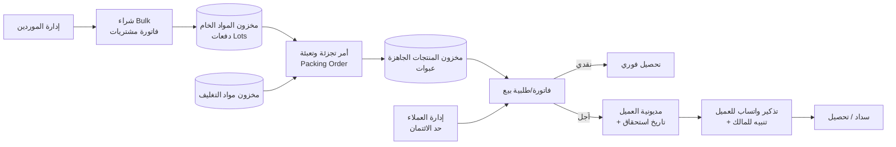
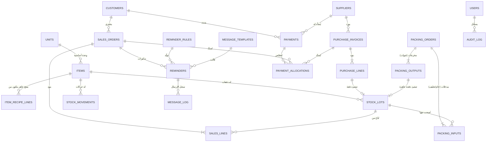

# وثيقة متطلبات المشروع (PRD / SRS)
## تطبيق سطح مكتب لإدارة الشراء بالجملة والتجزئة والتعبئة والبيع بالآجل

| البند | القيمة |
|---|---|
| **اسم المشروع (مؤقت)** | نظام إدارة التجزئة والتعبئة (Repack Manager) |
| **نوع التطبيق** | تطبيق سطح مكتب (Windows أساسًا، ويُفضَّل دعم macOS/Linux) |
| **قاعدة البيانات** | SQLite (ملف محلي واحد) |
| **لغة الواجهة** | العربية (RTL) كلغة أساسية، مع إمكانية إضافة الإنجليزية |
| **الإصدار** | 1.0 (مسودة متطلبات) |
| **الحالة** | جاهزة للتسليم لفريق/منصة التنفيذ |

---

## 1. نظرة عامة

### 1.1 الفكرة
صاحب النشاط يشتري **مواد خام بالجملة (Bulk)** من الموردين، ثم **يجزّئها ويعبّئها** في عبوات صغيرة بأوزان/أحجام محددة، ثم **يبيع** هذه العبوات للعملاء نقدًا أو **بالآجل (مداينة)** ضمن **حد ائتمان** ومواعيد سداد متفق عليها، مع **تذكير تلقائي بالسداد** عبر واتساب للعميل وتنبيه للمالك.

### 1.2 دورة العمل الأساسية



### 1.3 الأهداف
1. تتبّع كامل للتكلفة من الشراء الخام حتى سعر بيع العبوة (تكلفة دقيقة لكل وحدة بعد الفاقد والتغليف).
2. إدارة مديونية العملاء وحدود الائتمان بحيث لا يتجاوز أحد حدّه دون علم المالك.
3. تقليل التأخر في التحصيل عبر تذكيرات تلقائية.
4. واجهات شراء وبيع **سريعة ومرنة** تتعامل مع الطلبيات المعقدة دون تعقيد على المستخدم.
5. عمل كامل **دون إنترنت** (Offline-first) عدا إرسال رسائل واتساب.

### 1.4 خارج النطاق (الإصدار 1.0)
- المحاسبة العامة الكاملة (دليل حسابات، قيود يومية مزدوجة).
- الفواتير الإلكترونية الحكومية / الربط الضريبي (يُترك كنقطة توسّع مستقبلية).
- تطبيق موبايل أو نسخة ويب متعددة المستخدمين على الشبكة.
- التصنيع المعقّد متعدد المراحل (المطلوب: مرحلة تجزئة/تعبئة واحدة).

### 1.5 المصطلحات

| المصطلح | المعنى |
|---|---|
| **مادة خام (Raw Material)** | صنف يُشترى بكميات كبيرة (مثل: كيس 25 كجم). |
| **مادة تغليف (Packaging)** | عبوات، أكياس، ملصقات، كراتين… تُستهلك أثناء التعبئة. |
| **منتج جاهز (Finished Product / SKU)** | عبوة بحجم محدد جاهزة للبيع (مثل: كيس 500 جم). |
| **دفعة (Lot/Batch)** | كمية مشتراة أو مُنتَجة بتكلفة وتاريخ محددين. |
| **أمر تعبئة (Packing Order)** | عملية تحويل كمية خام + تغليف إلى عدد عبوات جاهزة. |
| **حد الائتمان (Credit Limit)** | أقصى مديونية مسموح بها للعميل. |
| **فترة السداد (Credit Days)** | عدد الأيام المتفق عليها لسداد الفاتورة الآجلة. |
| **الفاقد (Waste/Loss)** | كمية تضيع أثناء التجزئة (هدر، تبخر، انسكاب…). |

---

## 2. المستخدمون والصلاحيات

| الدور | الوصف | الصلاحيات الرئيسية |
|---|---|---|
| **المالك (Owner/Admin)** | صاحب النشاط | كل شيء: التكاليف والأرباح، الإعدادات، تجاوز حد الائتمان، النسخ الاحتياطي، إدارة المستخدمين. |
| **موظف مبيعات (Sales)** | يبيع ويحصّل | إنشاء طلبيات بيع، تسجيل تحصيلات، عرض العملاء. **بدون** رؤية التكلفة والأرباح (قابل للضبط). |
| **موظف مخزن/تعبئة (Warehouse)** | يعبّئ ويجرد | أوامر التعبئة، حركات المخزون، الجرد. |
| **مشتريات (Purchasing)** | يشتري | فواتير الشراء، الموردون، مدفوعات الموردين. |

**متطلبات:**
- **FR-USR-01**: تسجيل دخول باسم مستخدم وكلمة مرور (مُشفّرة بـ bcrypt/argon2).
- **FR-USR-02**: يمكن تشغيل التطبيق بمستخدم واحد (المالك) دون تسجيل دخول، كخيار في الإعدادات.
- **FR-USR-03**: صلاحيات قابلة للضبط لكل دور (عرض/إضافة/تعديل/حذف/تجاوز الائتمان/رؤية التكلفة).
- **FR-USR-04**: إجراءات حساسة (تجاوز حد الائتمان، حذف فاتورة، تعديل سعر مباع) تتطلب **PIN المالك**.

---

## 3. المتطلبات الوظيفية

> ترميز الأولوية: **P0** = أساسي لا غنى عنه، **P1** = مهم، **P2** = تحسين لاحق.

### 3.1 إدارة الأصناف والوحدات

**الأنواع الثلاثة للأصناف:** مادة خام، مادة تغليف، منتج جاهز.

| رقم | المتطلب | الأولوية |
|---|---|---|
| FR-ITM-01 | إضافة/تعديل/تعطيل صنف مع: الاسم، الكود (SKU)، الباركود (اختياري)، التصنيف، النوع، وحدة القياس الأساسية، حد أدنى للمخزون، ملاحظات، صورة (اختياري). | P0 |
| FR-ITM-02 | وحدات القياس: كجم، جرام، لتر، مل، قطعة، كرتونة، كيس… مع **جدول تحويل** بين الوحدات (مثال: 1 كيس = 25 كجم، 1 كجم = 1000 جم). | P0 |
| FR-ITM-03 | تخزين الكميات داخليًا بـ **وحدة أساسية صغيرة** (جرام / مل / قطعة) كأعداد صحيحة لتفادي أخطاء الكسور العشرية. | P0 |
| FR-ITM-04 | **وصفة التعبئة (Recipe/BOM)** للمنتج الجاهز: المادة الخام المصدر + الكمية لكل عبوة (مثل 500 جم) + مواد التغليف المستهلكة لكل عبوة (1 كيس + 1 ملصق) + تكلفة عمالة/تشغيل اختيارية لكل عبوة. | P0 |
| FR-ITM-05 | إمكانية أن ينتج نفس الخام عدة منتجات جاهزة (250 جم، 500 جم، 1 كجم). | P0 |
| FR-ITM-06 | تصنيفات هرمية للأصناف وبحث سريع بالاسم/الكود/الباركود. | P1 |
| FR-ITM-07 | قوائم أسعار بيع متعددة (تجزئة، جملة، عميل مميز) مع سعر خاص لكل عميل. | P1 |
| FR-ITM-08 | استيراد الأصناف من Excel/CSV وتصديرها. | P1 |

### 3.2 إدارة الموردين

| رقم | المتطلب | الأولوية |
|---|---|---|
| FR-SUP-01 | بيانات المورد: الاسم، الهاتف، واتساب، العنوان، ملاحظات، فترة السداد الافتراضية. | P0 |
| FR-SUP-02 | **كشف حساب المورد**: فواتير، مدفوعات، مرتجعات، الرصيد المستحق للمورد. | P0 |
| FR-SUP-03 | ربط الأصناف بالموردين وآخر سعر شراء (مقارنة أسعار الموردين لنفس الخام). | P1 |
| FR-SUP-04 | تنبيه بفواتير الموردين المستحقة الدفع قريبًا. | P1 |
| FR-SUP-05 | تقييم/تصنيف المورد (اختياري). | P2 |

### 3.3 المشتريات (شراء Bulk)

| رقم | المتطلب | الأولوية |
|---|---|---|
| FR-PUR-01 | إنشاء فاتورة شراء: مورد، تاريخ، رقم فاتورة المورد، بنود (صنف، كمية، وحدة، سعر الوحدة/سعر الإجمالي). | P0 |
| FR-PUR-02 | **المسودة (Draft)** ثم **اعتماد (Confirm)**؛ المخزون لا يتأثر إلا عند الاعتماد. | P0 |
| FR-PUR-03 | خصم على مستوى البند أو الفاتورة، وضريبة اختيارية (نسبة قابلة للضبط). | P1 |
| FR-PUR-04 | **مصاريف إضافية** (شحن، تحميل، عمولة) تُوزَّع على بنود الفاتورة (بالقيمة أو الوزن) لتدخل في **تكلفة الوحدة الفعلية (Landed Cost)**. | P0 |
| FR-PUR-05 | طرق الدفع: **نقدي كامل**، **آجل كامل**، **دفع جزئي**، مع تاريخ استحقاق للباقي. | P0 |
| FR-PUR-06 | عند الاعتماد يُنشأ **Lot** لكل بند بتكلفة الوحدة الفعلية وتاريخ الاستلام (وتاريخ الصلاحية اختياريًا). | P0 |
| FR-PUR-07 | مرتجع مشتريات لمورد (كليًا أو جزئيًا) مع أثره على المخزون ورصيد المورد. | P1 |
| FR-PUR-08 | تكرار فاتورة سابقة كمسودة جديدة (لتسريع الطلبات المتكررة). | P1 |
| FR-PUR-09 | إرفاق صورة/PDF للفاتورة الورقية. | P2 |

### 3.4 التجزئة والتعبئة (قلب النظام)

| رقم | المتطلب | الأولوية |
|---|---|---|
| FR-PCK-01 | **أمر تعبئة**: اختيار المنتج الجاهز → إدخال **عدد العبوات المطلوب** → يحسب النظام تلقائيًا المطلوب من الخام والتغليف حسب الوصفة، ويعرض التوفر. | P0 |
| FR-PCK-02 | إمكانية التعبئة **بالعكس**: إدخال كمية الخام المتاحة (مثلًا 25 كجم) → يحسب النظام عدد العبوات الممكنة (50 عبوة × 500 جم). | P0 |
| FR-PCK-03 | اختيار **الدفعة (Lot)** المصدر يدويًا أو تلقائيًا (FIFO/الأقدم أولًا) مع إمكانية السحب من أكثر من دفعة. | P0 |
| FR-PCK-04 | تسجيل **الفاقد الفعلي** (كمية مفقودة) وسببه؛ النظام يعرض نسبة الفاقد وأثرها على التكلفة. | P0 |
| FR-PCK-05 | **حساب تكلفة العبوة تلقائيًا**: (تكلفة الخام المستهلك + تكلفة التغليف + تكلفة تشغيل) ÷ عدد العبوات الصالحة. | P0 |
| FR-PCK-06 | عند الاعتماد: خصم الخام والتغليف من المخزون، وإضافة العبوات الجاهزة كـ **Lot** جديد بتكلفتها ورقم دفعة إنتاج وتاريخ إنتاج/انتهاء. | P0 |
| FR-PCK-07 | تحذير عند عدم كفاية الخام أو التغليف مع خيار المتابعة بإذن المالك أو تقليل الكمية تلقائيًا. | P0 |
| FR-PCK-08 | إلغاء/عكس أمر تعبئة (إن لم تُبَع العبوات) مع إعادة الكميات للمخزون. | P1 |
| FR-PCK-09 | **تتبّع (Traceability)**: من أي دفعة خام جاءت هذه العبوات، ومن أي مورد. | P1 |
| FR-PCK-10 | طباعة ملصقات (اسم المنتج، الوزن، تاريخ الإنتاج، الباركود) اختياريًا. | P2 |
| FR-PCK-11 | تحويل عبوات جاهزة إلى عبوات أخرى (إعادة تعبئة) — اختياري. | P2 |

**مثال توضيحي:**
> شراء 100 كجم سكر بتكلفة 4,000 ج + 200 ج شحن → تكلفة الكجم الفعلية 42 ج.
> تعبئة 180 كيس × 500 جم = 90 كجم؛ الفاقد 1 كجم، مستهلك من الخام 91 كجم → تكلفة خام = 3,822 ج.
> تغليف: 180 كيس × 0.5 ج + 180 ملصق × 0.2 ج = 126 ج.
> إجمالي التكلفة = 3,948 ج ÷ 180 = **21.93 ج/عبوة**.

### 3.5 المخزون

| رقم | المتطلب | الأولوية |
|---|---|---|
| FR-INV-01 | أرصدة لحظية لكل صنف (خام / تغليف / جاهز) بالوحدة الأساسية والوحدات البديلة. | P0 |
| FR-INV-02 | **سجل حركات المخزون (Stock Ledger)** غير قابل للحذف: شراء، تعبئة (صرف/إنتاج)، بيع، مرتجع، تسوية، جرد. | P0 |
| FR-INV-03 | **طريقة التكلفة**: متوسط مرجّح متحرك (افتراضي) أو FIFO بالدفعات (قابل للاختيار في الإعدادات). | P0 |
| FR-INV-04 | تنبيهات الوصول للحد الأدنى للمخزون. | P0 |
| FR-INV-05 | **الجرد**: إدخال الكميات الفعلية ← عرض الفروق ← اعتماد تسوية بسبب مسجّل. | P1 |
| FR-INV-06 | تتبع تاريخ الصلاحية وتنبيهات قرب الانتهاء. | P1 |
| FR-INV-07 | تقرير قيمة المخزون بالتكلفة وبسعر البيع. | P0 |
| FR-INV-08 | منع الرصيد السالب (افتراضيًا) مع إمكانية السماح به بإذن. | P0 |

### 3.6 إدارة العملاء والائتمان

| رقم | المتطلب | الأولوية |
|---|---|---|
| FR-CUS-01 | بيانات العميل: الاسم، الهاتف، **رقم واتساب**، العنوان، تصنيف، ملاحظات. | P0 |
| FR-CUS-02 | **حد الائتمان (Credit Limit)** لكل عميل (0 = بيع نقدي فقط). | P0 |
| FR-CUS-03 | **فترة السداد الافتراضية (Credit Days)** لكل عميل (مثل 7/15/30 يوم) مع إمكانية تعديلها لكل فاتورة. | P0 |
| FR-CUS-04 | عرض حالة العميل بلحظتها: الرصيد الحالي، المتاح من الحد، المتأخر، أقرب استحقاق. | P0 |
| FR-CUS-05 | **كشف حساب العميل** (فواتير، مدفوعات، مرتجعات، رصيد جارٍ) قابل للطباعة والتصدير PDF/إرسال واتساب. | P0 |
| FR-CUS-06 | تصنيف تلقائي للعميل: منتظم / متأخر / عالي المخاطرة، بناءً على سلوك السداد. | P1 |
| FR-CUS-07 | قائمة أسعار خاصة/خصم افتراضي لكل عميل. | P1 |
| FR-CUS-08 | حظر عميل مؤقتًا (إيقاف الآجل) مع سبب. | P1 |
| FR-CUS-09 | رصيد افتتاحي للعميل/المورد عند بدء الاستخدام. | P0 |

### 3.7 المبيعات والطلبيات

| رقم | المتطلب | الأولوية |
|---|---|---|
| FR-SAL-01 | إنشاء طلبية/فاتورة بيع: عميل (أو **عميل نقدي عام**)، بنود (منتج جاهز، كمية، سعر، خصم)، تاريخ. | P0 |
| FR-SAL-02 | حالات الطلبية: **مسودة → معتمدة → مسلّمة → مدفوعة/جزئيًا → ملغاة**. | P0 |
| FR-SAL-03 | طرق الدفع: نقدي، تحويل/محفظة، **آجل**، أو **مختلط** (جزء مدفوع الآن والباقي آجل). | P0 |
| FR-SAL-04 | **فحص الائتمان تلقائيًا** قبل الاعتماد (انظر قواعد العمل BR-CR). | P0 |
| FR-SAL-05 | تحديد **تاريخ الاستحقاق** تلقائيًا (تاريخ الفاتورة + Credit Days) وقابل للتعديل. | P0 |
| FR-SAL-06 | خصم المخزون عند الاعتماد، وحساب **تكلفة البضاعة المباعة (COGS)** وهامش الربح لكل بند. | P0 |
| FR-SAL-07 | مرتجع مبيعات (كلي/جزئي) يخفض مديونية العميل ويعيد المخزون. | P0 |
| FR-SAL-08 | طباعة فاتورة (A4 وإيصال حراري 80مم) وتصدير PDF ومشاركتها عبر واتساب. | P0 |
| FR-SAL-09 | عرض سعر (Quotation) يُحوَّل إلى طلبية. | P2 |
| FR-SAL-10 | تنبيه بأن السعر أقل من التكلفة (منع أو تحذير حسب الصلاحية). | P1 |
| FR-SAL-11 | تكرار طلبية سابقة للعميل بضغطة واحدة. | P1 |

### 3.8 المديونية والتحصيل (المداينة)

| رقم | المتطلب | الأولوية |
|---|---|---|
| FR-DBT-01 | **تسجيل دفعة من عميل**: مبلغ، تاريخ، طريقة الدفع، ملاحظة. | P0 |
| FR-DBT-02 | **تخصيص الدفعة على الفواتير**: تلقائيًا (الأقدم أولًا) أو يدويًا على فواتير محددة. | P0 |
| FR-DBT-03 | دفعات جزئية متعددة على نفس الفاتورة مع تتبّع المتبقي. | P0 |
| FR-DBT-04 | دفعة زائدة تُسجَّل كـ **رصيد دائن للعميل** يُستخدم في فواتير لاحقة. | P1 |
| FR-DBT-05 | **تقرير أعمار الديون (Aging)**: غير مستحق / 1-30 / 31-60 / 61-90 / +90 يوم. | P0 |
| FR-DBT-06 | **وعد بالسداد (Promise to Pay)**: تسجيل موعد جديد يتفق عليه مع العميل وتعديل التذكير وفقًا له. | P1 |
| FR-DBT-07 | إعفاء/شطب جزء من الدين (Write-off) بإذن المالك وسبب مسجّل. | P1 |
| FR-DBT-08 | إيصال استلام نقدية قابل للطباعة/الإرسال. | P1 |
| FR-DBT-09 | سداد المورد بنفس آلية التخصيص (دفعات صادرة للموردين). | P0 |

### 3.9 نظام التذكير (واتساب + المالك)

**الفكرة:** تذكير تلقائي للعميل عند اقتراب موعد السداد، وتنبيه للمالك بالمستحقات القريبة والمتأخرة.

| رقم | المتطلب | الأولوية |
|---|---|---|
| FR-REM-01 | **قواعد تذكير قابلة للضبط** (عامة، وقابلة للتخصيص لكل عميل): مثل **قبل الاستحقاق بـ 3 أيام**، **قبل يوم**، **يوم الاستحقاق**، **بعد التأخر بـ 1 / 7 / 14 يوم**. | P0 |
| FR-REM-02 | **قوالب رسائل واتساب** بمتغيرات: `{اسم_العميل}`، `{رقم_الفاتورة}`، `{المبلغ_المتبقي}`، `{تاريخ_الاستحقاق}`، `{اجمالي_المديونية}`، `{اسم_المنشأة}` — بصياغات مختلفة لكل مرحلة (تذكير لطيف / يوم الاستحقاق / تأخير). | P0 |
| FR-REM-03 | **جدولة تلقائية**: عند اعتماد فاتورة آجلة تُنشأ تذكيراتها المجدولة، وتُحدَّث/تُلغى عند السداد أو تغيير الموعد. | P0 |
| FR-REM-04 | **شاشة "التذكيرات اليومية"**: قائمة بكل ما يستحق إرساله اليوم مع أزرار: إرسال / تأجيل / تخطي / تسجيل وعد بالسداد. | P0 |
| FR-REM-05 | **تنبيه المالك**: (أ) إشعار سطح مكتب (Toast) عند فتح التطبيق وعند حلول موعد تذكير؛ (ب) لافتة/عدّاد داخل التطبيق؛ (ج) **ملخص يومي** بمستحقات اليوم والغد والمتأخرات؛ (د) رسالة واتساب للمالك اختياريًا. | P0 |
| FR-REM-06 | **سجل الرسائل (Message Log)**: كل رسالة أُرسلت/فشلت/تخطيت، الوقت، الفاتورة، النص النهائي. | P0 |
| FR-REM-07 | **منع التكرار**: لا تُرسل نفس المرحلة لنفس الفاتورة مرتين، وإيقاف التذكير فور السداد الكامل. | P0 |
| FR-REM-08 | **ساعات الإرسال المسموحة** (مثلًا 9 ص – 9 م) وعدم الإرسال في أيام العطل المحددة. | P1 |
| FR-REM-09 | **تعويض الفائت (Catch-up)**: إن كان التطبيق مغلقًا وقت التذكير، تظهر التذكيرات الفائتة عند فتحه. | P0 |
| FR-REM-10 | إمكانية تشغيل التطبيق **في الخلفية (System Tray)** وبدء تلقائي مع تشغيل الجهاز لضمان التذكير. | P1 |
| FR-REM-11 | إرسال **كشف الحساب** أو **صورة/PDF الفاتورة** مع الرسالة. | P1 |

#### خيارات ربط واتساب (تُحدَّد عند التنفيذ ويجب دعم الأول كحد أدنى)

| الخيار | آلية العمل | الإيجابيات | السلبيات |
|---|---|---|---|
| **A. رابط واتساب المباشر** (`https://wa.me/<رقم>?text=<نص>`) — **افتراضي** | يفتح واتساب (Desktop/Web) والنص جاهز، والمستخدم يضغط "إرسال". | مجاني، آمن، بلا خطر حظر، بسيط جدًا. | شبه يدوي (ضغطة لكل رسالة). |
| **B. WhatsApp Business Cloud API** (الرسمي) | إرسال آلي بالكامل عبر واجهة Meta. | آلي بالكامل، رسمي، موثوق. | يتطلب حساب Business وقوالب رسائل معتمدة، اتصال إنترنت، تكلفة لكل محادثة، إعداد تقني. |
| **C. مكتبات غير رسمية** (مثل whatsapp-web.js / Baileys) | محاكاة واتساب ويب. | آلي ومجاني. | **مخالف لشروط واتساب وخطر حظر الرقم** — لا يُنصح به ويُترك كخيار متقدم بتحذير واضح. |

- **FR-REM-12**: تصميم طبقة **`MessagingProvider`** مجردة (Interface) بحيث يمكن تبديل A/B/C دون تعديل بقية النظام.
- **FR-REM-13**: التحقق من صيغة رقم الهاتف وتطبيعها إلى الصيغة الدولية (مثال مصر: `+20…`) مع رمز دولة افتراضي في الإعدادات.

### 3.10 المصروفات والخزينة

| رقم | المتطلب | الأولوية |
|---|---|---|
| FR-EXP-01 | تسجيل مصروفات تشغيلية (إيجار، كهرباء، نقل، رواتب…) بتصنيفات. | P1 |
| FR-EXP-02 | **حركة الخزينة**: كل تحصيل/سداد/مصروف يؤثر على رصيد النقدية والبنك/المحفظة. | P1 |
| FR-EXP-03 | إغلاق يومي (Day Close): مطابقة النقدية الفعلية بالمتوقعة. | P2 |

### 3.11 التقارير ولوحة التحكم

**لوحة التحكم (Dashboard):**
- مبيعات اليوم/الأسبوع/الشهر، صافي الربح التقريبي.
- إجمالي المستحق على العملاء، **المتأخر**، **المستحق خلال 7 أيام**.
- إجمالي المستحق للموردين.
- تنبيهات: نقص مخزون، قرب انتهاء صلاحية، عملاء تجاوزوا/اقتربوا من حدّ الائتمان.
- أعلى المنتجات مبيعًا وربحية، أعلى العملاء شراءً/تأخرًا.

**التقارير الأساسية (P0/P1):**
1. أعمار ديون العملاء (Aging) — P0
2. كشف حساب عميل / مورد — P0
3. المبيعات (حسب اليوم/المنتج/العميل) — P0
4. **ربحية المنتج والفاتورة والعميل** (سعر البيع − التكلفة) — P0
5. **تقرير التعبئة**: عدد الأوامر، نسبة الفاقد، تكلفة العبوة عبر الزمن — P1
6. المخزون الحالي وقيمته — P0
7. حركة صنف (Stock Card) — P1
8. المشتريات ومقارنة أسعار الموردين — P1
9. المصروفات وصافي الربح — P1
10. سجل التذكيرات المرسلة وفعاليتها (نسبة الاستجابة/السداد بعد التذكير) — P2

- **FR-RPT-01**: كل تقرير قابل للفلترة بالتاريخ والعميل/المورد/الصنف، والتصدير إلى **Excel و PDF** والطباعة.

### 3.12 الإعدادات والنظام

| رقم | المتطلب | الأولوية |
|---|---|---|
| FR-SET-01 | بيانات المنشأة (الاسم، الشعار، العنوان، الهاتف) تظهر في المطبوعات. | P0 |
| FR-SET-02 | العملة (افتراضيًا **الجنيه المصري EGP** وقابلة للتغيير)، عدد الخانات العشرية، تنسيق التاريخ. | P0 |
| FR-SET-03 | ترقيم تلقائي للمستندات (INV-2026-0001، PUR-…، PCK-…) قابل للتخصيص. | P0 |
| FR-SET-04 | إعدادات الائتمان الافتراضية والتذكير والمخزون وطريقة التكلفة. | P0 |
| FR-SET-05 | **نسخ احتياطي**: يدوي بضغطة واحدة + **تلقائي مجدول** (يوميًا/عند الإغلاق) إلى مجلد يختاره المستخدم (مثل فلاشة/Google Drive Desktop)، مع الاحتفاظ بآخر N نسخة. | P0 |
| FR-SET-06 | **استعادة** نسخة احتياطية مع تحقق من سلامتها وتحذير قبل الاستبدال. | P0 |
| FR-SET-07 | **سجل التدقيق (Audit Log)**: من فعل ماذا ومتى (إنشاء/تعديل/حذف/تجاوز ائتمان/تعديل سعر). | P1 |
| FR-SET-08 | استيراد/تصدير بيانات (العملاء، الموردين، الأصناف، الأرصدة الافتتاحية) من/إلى Excel. | P1 |
| FR-SET-09 | **التحديث التلقائي** للتطبيق (Auto-update) مع ترحيل تلقائي لبنية قاعدة البيانات (Migrations). | P1 |

---

## 4. قواعد العمل (Business Rules)

### 4.1 قواعد الائتمان (BR-CR)

- **BR-CR-01**: `الرصيد المستخدم = إجمالي الأرصدة غير المسددة لفواتير العميل المعتمدة` (ناقص أي رصيد دائن).
- **BR-CR-02**: عند اعتماد فاتورة تحتوي جزءًا آجلًا:
  `الرصيد المستخدم + الجزء الآجل الجديد ≤ حد الائتمان` ⇒ **مسموح**.
- **BR-CR-03**: إذا تجاوز الحد: **يمنع النظام الاعتماد** ويعرض: الحد، المستخدم، المتاح، المبلغ المطلوب. ويعرض خيارات: (أ) خفض الجزء الآجل ودفع الفرق نقدًا، (ب) **طلب تجاوز بـ PIN المالك** مع تسجيل السبب في الـ Audit Log، (ج) إلغاء.
- **BR-CR-04**: **منع الآجل تلقائيًا** (قابل للتفعيل في الإعدادات) إذا كان لدى العميل فواتير **متأخرة أكثر من X يوم**، بغضّ النظر عن الحد المتاح.
- **BR-CR-05**: عرض **تحذير مبكر** (لون أصفر) عند بلوغ العميل 80% من حدّه (النسبة قابلة للضبط).
- **BR-CR-06**: المبيعات النقدية بالكامل لا تخضع لفحص الائتمان.
- **BR-CR-07**: العميل المحظور لا يمكن البيع له آجلًا.

### 4.2 قواعد التكلفة والمخزون (BR-INV)

- **BR-INV-01**: تكلفة وحدة الخام = (إجمالي البند بعد الخصم + نصيبه من المصاريف الإضافية) ÷ الكمية بالوحدة الأساسية.
- **BR-INV-02**: تكلفة العبوة الجاهزة = (تكلفة الخام المستهلك شاملة الفاقد + التغليف + التشغيل) ÷ عدد العبوات الصالحة.
- **BR-INV-03**: لا يُسمح بتعديل/حذف مستند معتمد أثّر على المخزون؛ يتم **عكسه** بمستند مرتجع/تسوية للحفاظ على سلامة السجل. (مع استثناء تعديل الملاحظات).
- **BR-INV-04**: كل حركة مخزون مرتبطة بمستند مصدر (`ref_type`, `ref_id`).
- **BR-INV-05**: عند سحب الخام لأمر تعبئة من أكثر من دفعة، تُحسب التكلفة بحسب طريقة التكلفة المختارة.

### 4.3 قواعد الدفع والاستحقاق (BR-PAY)

- **BR-PAY-01**: `تاريخ الاستحقاق = تاريخ الفاتورة + Credit Days` ما لم يُحدَّد يدويًا.
- **BR-PAY-02**: حالة الفاتورة تُشتق تلقائيًا: `غير مدفوعة | مدفوعة جزئيًا | مدفوعة | متأخرة (المتبقي > 0 وتاريخ الاستحقاق < اليوم)`.
- **BR-PAY-03**: الدفعة لا تُحذف بل **تُعكس** بقيد عكسي مع سبب.
- **BR-PAY-04**: مجموع تخصيصات الدفعة ≤ مبلغ الدفعة، والفائض يذهب لرصيد دائن.

### 4.4 قواعد التذكير (BR-REM)

- **BR-REM-01**: لكل فاتورة آجلة غير مسددة تُجدول التذكيرات وفق القاعدة السارية عند اعتمادها.
- **BR-REM-02**: عند تسجيل **وعد بالسداد** بتاريخ جديد تُعاد جدولة التذكيرات المتبقية بناءً عليه.
- **BR-REM-03**: عند السداد الكامل تُلغى كل التذكيرات المعلّقة فورًا.
- **BR-REM-04**: يجمع النظام تذكيرات العميل الواحد بأكثر من فاتورة في **رسالة واحدة** (اختياري) لتفادي الإزعاج.
- **BR-REM-05**: يتوقف التذكير الآلي بعد N محاولة بدون رد، ويُرفع تنبيه للمالك للتصرف يدويًا.

---

## 5. متطلبات واجهة وتجربة المستخدم (UX)

> الهدف: **سهل، سريع، واضح، منظم، ومريح جدًا** مع القدرة على معالجة العمليات المعقدة.

### 5.1 مبادئ عامة

- **UX-01**: واجهة عربية **RTL** بالكامل بخط واضح (مثل Cairo / Tajawal / Noto Naskh) وأحجام قابلة للتكبير.
- **UX-02**: قائمة تنقل جانبية ثابتة (Sidebar) مقسّمة منطقيًا: `الرئيسية | المشتريات | التعبئة | المخزون | المبيعات | العملاء | الموردون | التحصيل | التقارير | الإعدادات`.
- **UX-03**: **بحث شامل (Ctrl+K / Command Palette)** للانتقال لأي شاشة أو عميل أو فاتورة أو صنف.
- **UX-04**: **اختصارات لوحة المفاتيح** لكل الإجراءات الرئيسية (مثال: `F2` بيع جديد، `F3` شراء جديد، `F4` أمر تعبئة، `Ctrl+S` حفظ، `Ctrl+Enter` اعتماد، `Esc` إغلاق، `Ctrl+F` بحث).
- **UX-05**: تنقل كامل بلوحة المفاتيح (Tab/Enter/الأسهم) دون الحاجة للماوس في شاشات الإدخال.
- **UX-06**: **الوضع الفاتح والداكن**، وألوان دلالية ثابتة: 🟢 سليم / 🟡 تحذير / 🔴 متأخر أو خطر.
- **UX-07**: رسائل خطأ **واضحة وقابلة للتنفيذ** (ماذا حدث وماذا أفعل)، وتأكيد قبل أي عملية خطرة، مع **تراجع (Undo)** حيثما أمكن.
- **UX-08**: حفظ تلقائي للمسودات، وعدم فقدان أي بيانات عند إغلاق التطبيق فجأة.
- **UX-09**: زمن استجابة تفاعلي **أقل من 200ms** لمعظم الإجراءات.
- **UX-10**: **شاشة ترحيب/إعداد أولي (Onboarding)** تُرشد لإضافة أول مورد وصنف وعميل.

### 5.2 واجهة البيع المرنة (Sales Workspace)

| رقم | المتطلب |
|---|---|
| UX-SAL-01 | شاشة بيع بتخطيط **جدول بنود قابل للتحرير مباشرة (Inline Grid)**: اكتب اسم/باركود المنتج ← Enter ← الكمية ← Enter ← بند جديد. |
| UX-SAL-02 | **أكثر من طلبية مفتوحة في وقت واحد** (تبويبات/Tabs) لخدمة عدة عملاء دون فقدان أي منها. |
| UX-SAL-03 | **لوحة جانبية للعميل** تظهر فور اختياره: الرصيد، المتاح من الحد، المتأخر، آخر 5 فواتير، مع مؤشر لوني للحد. |
| UX-SAL-04 | **مؤشر ائتمان حيّ**: شريط تقدم يتحدث أثناء إضافة البنود يوضح هل ستتجاوز الطلبية الحد **قبل** محاولة الاعتماد. |
| UX-SAL-05 | تعديل الكمية والسعر والخصم في نفس السطر، مع إظهار **الربح/الهامش** للمالك (قابل للإخفاء عن الموظف). |
| UX-SAL-06 | **أزرار دفع سريعة**: نقدي كامل / آجل كامل / دفع جزئي (يفتح حقل المبلغ ويحسب الباقي وتاريخ الاستحقاق تلقائيًا). |
| UX-SAL-07 | اقتراحات ذكية: منتجات العميل المعتادة، آخر سعر بيع له، "أضف كل ما اشتراه آخر مرة". |
| UX-SAL-08 | عرض **الكمية المتاحة** بجوار كل منتج وتحذير فوري عند عدم كفاية المخزون. |
| UX-SAL-09 | إتمام الطلبية بضغطة واحدة يشمل: اعتماد + طباعة/PDF + خيار إرسال واتساب. |
| UX-SAL-10 | حفظ كمسودة، تعليق (Hold)، ثم استكمال لاحقًا. |
| UX-SAL-11 | إضافة **عميل جديد سريعًا** من داخل شاشة البيع (نافذة صغيرة بحقول أساسية) دون مغادرة الطلبية. |

### 5.3 واجهة الشراء المرنة (Purchase Workspace)

| رقم | المتطلب |
|---|---|
| UX-PUR-01 | نفس فلسفة الجدول القابل للتحرير مع تبويبات متعددة للفواتير المفتوحة. |
| UX-PUR-02 | الإدخال بـ **الوحدة الكبيرة** (كيس/شوال/طن) والنظام يحوّل للوحدة الأساسية ويعرض سعر الكجم الناتج. |
| UX-PUR-03 | خانات **المصاريف الإضافية** تظهر في أسفل الفاتورة مع معاينة فورية لتأثيرها على **تكلفة الكجم**. |
| UX-PUR-04 | مقارنة فورية بـ **آخر سعر شراء** وتنبيه عند ارتفاع كبير. |
| UX-PUR-05 | إضافة **مورد/صنف جديد** بسرعة من داخل الفاتورة. |
| UX-PUR-06 | خيار **"اعتماد + ابدأ التعبئة"** لينتقل مباشرة لأمر تعبئة من الدفعة المستلمة. |

### 5.4 واجهة التعبئة

- **UX-PCK-01**: معالج بسيط في شاشة واحدة: اختر المنتج ← أدخل عدد العبوات (أو كمية الخام) ← شاهد فورًا: الخام المطلوب، التغليف المطلوب، التوفر، الفاقد المتوقع، **تكلفة العبوة**.
- **UX-PCK-02**: أزرار سريعة لأحجام العبوات الشائعة، ومعاينة "ماذا لو" (What-if) لتغيير الفاقد.
- **UX-PCK-03**: بعد الاعتماد يظهر ملخص النتيجة (العبوات المنتجة، الفاقد الفعلي، التكلفة، الرصيد الجديد).

### 5.5 قائمة الشاشات الرئيسية

1. تسجيل الدخول / اختيار المستخدم
2. لوحة التحكم (Dashboard)
3. الأصناف (قائمة/تفاصيل/وصفة التعبئة)
4. الموردون (قائمة/تفاصيل/كشف حساب)
5. فواتير الشراء (قائمة/إنشاء)
6. أوامر التعبئة (قائمة/إنشاء)
7. المخزون (أرصدة/حركات/جرد/دفعات)
8. العملاء (قائمة/تفاصيل/كشف حساب/الائتمان)
9. المبيعات (قائمة/إنشاء/مرتجع)
10. التحصيل والمديونية (دفعات/أعمار ديون/وعود سداد)
11. مركز التذكيرات (اليوم/المجدولة/السجل/القوالب)
12. المصروفات والخزينة
13. التقارير
14. الإعدادات (المنشأة، المستخدمون، الائتمان، التذكير/واتساب، النسخ الاحتياطي، الترقيم، الطباعة)

---

## 6. نموذج البيانات (SQLite)

### 6.1 مبادئ التصميم

- **الأموال**: تُخزَّن كأعداد صحيحة بأصغر وحدة (قرش/Piastre) في أعمدة `INTEGER` لتفادي أخطاء الفاصلة العائمة.
- **الكميات**: أعداد صحيحة بالوحدة الأساسية الصغيرة (جرام/مل/قطعة). (بديل: `INTEGER` بمقياس ×1000 لكسور القطع).
- **التواريخ**: نص بصيغة ISO-8601 (`YYYY-MM-DD` / `YYYY-MM-DDTHH:MM:SS`) بتوقيت محلي موحّد.
- **المفاتيح**: `INTEGER PRIMARY KEY AUTOINCREMENT` (أو UUID إن أُريد مزامنة مستقبلية).
- **الحذف**: حذف منطقي `is_active` / `deleted_at` للبيانات المرجعية، ومنع حذف ما له حركات.
- **السلامة**: `PRAGMA foreign_keys = ON;` و `PRAGMA journal_mode = WAL;` و `PRAGMA synchronous = NORMAL;`.
- **المعاملات (Transactions)**: كل عملية مركّبة (اعتماد فاتورة، أمر تعبئة، تخصيص دفعة) تتم داخل **معاملة ذرّية واحدة**.
- **الترحيل (Migrations)**: جدول `schema_version` وسكربتات ترقية مرقمة.
- **الفهارس**: على كل مفتاح أجنبي، وعلى `(customer_id, due_date)`، `(item_id, created_at)` في الحركات، وعلى الحقول المبحوث بها.

### 6.2 مخطط العلاقات (ERD)



### 6.3 الجداول الأساسية (مقترح)

> الأعمدة الموضّحة هي **الحد الأدنى المقترح**، ويمكن للمنفّذ إضافة `created_at`, `updated_at`, `created_by` لكل جدول.

**المرجعية:**

| الجدول | أهم الأعمدة |
|---|---|
| `settings` | `key` (PK), `value` |
| `users` | `id`, `username`, `password_hash`, `role`, `pin_hash`, `is_active` |
| `units` | `id`, `name`, `symbol`, `dimension` (وزن/حجم/عدد) |
| `unit_conversions` | `id`, `from_unit_id`, `to_unit_id`, `factor` |
| `categories` | `id`, `name`, `parent_id` |
| `items` | `id`, `sku`, `barcode`, `name`, `type` (`raw`/`packaging`/`finished`), `category_id`, `base_unit_id`, `pack_size_base` (لحجم العبوة للمنتج الجاهز), `min_stock`, `default_sale_price`, `is_active` |
| `item_recipe_lines` | `id`, `finished_item_id`, `component_item_id`, `qty_per_unit_base`, `line_type` (`raw`/`packaging`), `extra_cost_per_unit` |
| `suppliers` | `id`, `name`, `phone`, `whatsapp`, `address`, `default_credit_days`, `opening_balance`, `notes`, `is_active` |
| `customers` | `id`, `name`, `phone`, `whatsapp`, `address`, `credit_limit`, `credit_days`, `opening_balance`, `is_blocked`, `block_reason`, `reminder_enabled`, `notes`, `is_active` |
| `price_lists` / `price_list_items` | أسعار بيع متعددة، وأسعار خاصة بعميل |

**العمليات:**

| الجدول | أهم الأعمدة |
|---|---|
| `purchase_invoices` | `id`, `number`, `supplier_id`, `date`, `status` (`draft`/`confirmed`/`cancelled`), `subtotal`, `discount`, `tax`, `extra_costs_total`, `total`, `paid_amount`, `due_date`, `notes` |
| `purchase_lines` | `id`, `invoice_id`, `item_id`, `qty_input`, `unit_input_id`, `qty_base`, `unit_price`, `line_total`, `allocated_extra_cost`, `landed_unit_cost_base` |
| `purchase_extra_costs` | `id`, `invoice_id`, `label`, `amount`, `allocation_method` |
| `stock_lots` | `id`, `item_id`, `source_type` (`purchase`/`packing`/`adjustment`/`opening`), `source_id`, `lot_code`, `qty_initial_base`, `qty_remaining_base`, `unit_cost_base`, `received_at`, `expiry_date` |
| `stock_movements` | `id`, `item_id`, `lot_id`, `movement_type`, `qty_base` (±), `unit_cost_base`, `ref_type`, `ref_id`, `created_at`, `created_by` |
| `packing_orders` | `id`, `number`, `date`, `finished_item_id`, `planned_units`, `produced_units`, `waste_qty_base`, `waste_reason`, `raw_cost_total`, `packaging_cost_total`, `overhead_cost_total`, `unit_cost`, `status`, `notes` |
| `packing_inputs` | `id`, `order_id`, `item_id`, `lot_id`, `qty_base`, `unit_cost_base` |
| `packing_outputs` | `id`, `order_id`, `item_id`, `qty_units`, `unit_cost`, `output_lot_id` |
| `sales_orders` | `id`, `number`, `customer_id`, `date`, `status`, `subtotal`, `discount`, `tax`, `total`, `paid_amount`, `credit_amount`, `due_date`, `credit_override_by`, `credit_override_reason`, `notes` |
| `sales_lines` | `id`, `order_id`, `item_id`, `lot_id`, `qty`, `unit_price`, `discount`, `line_total`, `unit_cost`, `cogs_total` |
| `returns` (+ `return_lines`) | مرتجعات مبيعات/مشتريات مرتبطة بالفاتورة الأصلية |
| `payments` | `id`, `party_type` (`customer`/`supplier`), `party_id`, `direction` (`in`/`out`), `amount`, `method`, `date`, `reference`, `notes`, `reversed_of_id` |
| `payment_allocations` | `id`, `payment_id`, `doc_type` (`sales`/`purchase`), `doc_id`, `amount` |
| `promises_to_pay` | `id`, `customer_id`, `sales_order_id`, `promised_date`, `amount`, `status`, `notes` |
| `expenses` | `id`, `date`, `category`, `amount`, `method`, `notes` |
| `cash_transactions` | `id`, `account`, `amount`, `type`, `ref_type`, `ref_id`, `date` |

**التذكيرات والنظام:**

| الجدول | أهم الأعمدة |
|---|---|
| `reminder_rules` | `id`, `name`, `offset_days` (سالب = قبل، موجب = بعد), `template_id`, `is_active`, `customer_id` (اختياري للتخصيص) |
| `message_templates` | `id`, `name`, `channel`, `body`, `stage` |
| `reminders` | `id`, `sales_order_id`, `customer_id`, `rule_id`, `scheduled_for`, `status` (`pending`/`sent`/`skipped`/`failed`/`cancelled`), `sent_at` |
| `message_log` | `id`, `reminder_id`, `to_phone`, `rendered_body`, `provider`, `status`, `error`, `created_at` |
| `owner_notifications` | `id`, `type`, `payload`, `is_read`, `created_at` |
| `audit_log` | `id`, `user_id`, `action`, `entity`, `entity_id`, `before_json`, `after_json`, `created_at` |
| `backups_log` | `id`, `path`, `size`, `created_at`, `status` |
| `schema_version` | `version`, `applied_at` |

### 6.4 عروض (Views) مقترحة لتسهيل التقارير

- `v_customer_balance`: رصيد كل عميل (الرصيد الافتتاحي + الفواتير − الدفعات − المرتجعات).
- `v_sales_open_invoices`: الفواتير غير المسددة مع المتبقي وأيام التأخير.
- `v_customer_credit_status`: الحد، المستخدم، المتاح، النسبة.
- `v_stock_balance`: رصيد كل صنف من مجموع `qty_remaining_base` للدفعات.
- `v_aging_report`: أعمار الديون مجمّعة.

---

## 7. المتطلبات غير الوظيفية

| الفئة | المتطلب |
|---|---|
| **الأداء** | فتح التطبيق < 3 ثوانٍ؛ بحث/فلترة على 50,000 صنف/فاتورة < 300ms؛ اعتماد فاتورة < 500ms. |
| **الموثوقية** | لا فقدان بيانات عند انقطاع الكهرباء (WAL + معاملات ذرّية)؛ فحص `PRAGMA integrity_check` دوريًا. |
| **الأمان** | تشفير كلمات المرور (bcrypt/argon2)؛ خيار تشفير ملف قاعدة البيانات (SQLCipher) وتشفير النسخ الاحتياطية؛ حماية PIN للإجراءات الحساسة؛ عدم تسجيل بيانات حساسة في ملفات السجل. |
| **الخصوصية** | كل البيانات محلية؛ لا تُرسل لأي خدمة خارجية عدا واتساب بإعدادات المستخدم. |
| **العمل دون اتصال** | كل الوظائف تعمل Offline عدا إرسال واتساب الآلي (B) والتحديثات. |
| **سهولة الاستخدام** | تعلّم الوظائف الأساسية في أقل من ساعة؛ تنقل بالكيبورد؛ نصوص واضحة بالعربية. |
| **قابلية الصيانة** | فصل الطبقات (واجهة / منطق أعمال / بيانات)؛ اختبارات وحدة لقواعد الائتمان والتكلفة والتخصيص؛ ترحيلات قاعدة بيانات مرقمة. |
| **قابلية التوسع** | تصميم `MessagingProvider` قابل للتبديل؛ إمكانية لاحقًا الانتقال لخادم/مزامنة متعددة الفروع. |
| **التوافق** | Windows 10/11 (64-bit) كحد أدنى؛ يعمل على أجهزة متواضعة (4GB RAM). |
| **التوطين** | RTL، التقويم الميلادي (مع خيار الهجري للعرض)، أرقام عربية/هندية اختيارية، عملة قابلة للضبط. |
| **الطباعة** | فواتير A4 و إيصالات حرارية 58/80مم، معاينة قبل الطباعة، قوالب قابلة للتعديل. |
| **النسخ الاحتياطي** | RPO ≤ 24 ساعة (نسخة يومية تلقائية)، واستعادة في أقل من دقيقة. |
| **التسجيل والتشخيص** | ملفات سجل أخطاء محلية وزر "تصدير سجل التشخيص" للدعم الفني. |

---

## 8. سيناريوهات استخدام رئيسية (للاختبار والقبول)

### سيناريو 1: دورة كاملة (شراء ← تعبئة ← بيع آجل ← تحصيل)
1. إضافة مورد "الشركة الأولى" وأصناف: سكر (خام)، أكياس 500 جم (تغليف)، "سكر 500 جم" (جاهز) بوصفة: 500 جم خام + 1 كيس.
2. فاتورة شراء 100 كجم سكر بـ 4,000 ج + شحن 200 ج، دفع 2,000 ج نقدًا والباقي آجل بعد 15 يومًا.
3. أمر تعبئة 180 عبوة؛ فاقد 1 كجم ⇒ يظهر مخزون الجاهز 180 وتكلفة العبوة.
4. إضافة عميل "محل النور" بحد ائتمان 5,000 ج وسداد 15 يومًا وواتساب صحيح.
5. بيع 100 عبوة بالآجل بقيمة 3,000 ج ⇒ الرصيد 3,000 والمتاح 2,000 وتاريخ استحقاق بعد 15 يومًا.
6. قبل الاستحقاق بـ 3 أيام يظهر تذكير في "مركز التذكيرات" ويُفتح واتساب برسالة جاهزة، ويصل تنبيه للمالك.
7. العميل يسدد 1,000 ج ⇒ المتبقي 2,000 والفاتورة "مدفوعة جزئيًا".
8. سداد الباقي ⇒ تُلغى التذكيرات المتبقية فورًا.

### سيناريو 2: تجاوز حد الائتمان
- محاولة بيع آجل 2,500 ج للعميل السابق (المتاح 2,000 ج) ⇒ يُمنع الاعتماد مع خيارات (دفع الفرق نقدًا / تجاوز بـ PIN المالك / إلغاء)، ويُسجَّل التجاوز في Audit Log.

### سيناريو 3: تعدد الطلبيات
- فتح 3 طلبيات بيع متزامنة في تبويبات، تعليق إحداها وإتمام الأخرى، ثم استكمال المعلّقة بدون فقد أي بيانات.

### سيناريو 4: التذكير الفائت
- إغلاق التطبيق يومين، ثم فتحه ⇒ تظهر التذكيرات التي فاتت مع خيار الإرسال أو التخطي.

### سيناريو 5: مرتجع
- مرتجع 10 عبوات من فاتورة آجلة غير مسددة ⇒ ينقص رصيد العميل وتعود العبوات للمخزون بنفس تكلفتها.

---

## 9. معايير القبول العامة

- [ ] كل حساب مالي/كمي يطابق الحساب اليدوي للأمثلة الواردة في الوثيقة.
- [ ] لا يمكن اعتماد بيع آجل يتجاوز الحد دون PIN المالك، ويظهر ذلك في سجل التدقيق.
- [ ] لا يُسمح بمخزون سالب افتراضيًا.
- [ ] رصيد العميل في كشف الحساب = مجموع الفواتير المتبقية في تقرير الأعمار = الرصيد في لوحة التحكم.
- [ ] تذكيرات واتساب تُنشأ وتُحدَّث وتُلغى تلقائيًا بحسب حالة السداد/الوعود دون تكرار.
- [ ] النسخ الاحتياطي والاستعادة يعملان ويحافظان على كل البيانات.
- [ ] إنشاء فاتورة بيع من ٣ بنود يتم بدون ماوس في أقل من 30 ثانية.
- [ ] التطبيق يعمل Offline بالكامل باستثناء الإرسال الآلي.
- [ ] كل الشاشات RTL بلا تشوّه أو قصّ نصوص.

---

## 10. خطة التنفيذ المقترحة (مراحل)

| المرحلة | المحتوى | النتيجة |
|---|---|---|
| **المرحلة 1 — الأساس (MVP)** | الإعدادات، الوحدات، الأصناف والوصفات، الموردون، العملاء + حد الائتمان، فاتورة شراء، أمر تعبئة، المخزون والدفعات، فاتورة بيع (نقدي/آجل + فحص الائتمان)، تسجيل التحصيل، كشف الحساب، نسخ احتياطي يدوي/تلقائي، لوحة تحكم أساسية. | دورة العمل كاملة تعمل. |
| **المرحلة 2 — التذكيرات والتحصيل** | قواعد وقوالب التذكير، مركز التذكيرات، واتساب (الخيار A)، تنبيهات المالك، أعمار الديون، وعود السداد، Catch-up، System Tray. | تحصيل منضبط. |
| **المرحلة 3 — الاحترافية** | الصلاحيات والمستخدمون، Audit Log، المرتجعات، الجرد، الصلاحية، تقارير الربحية والفاقد، استيراد/تصدير Excel، الطباعة الحرارية، قوائم أسعار. | نظام ناضج. |
| **المرحلة 4 — تحسينات** | WhatsApp Cloud API، ملصقات وباركود، المصروفات والخزينة، Auto-update، تشفير قاعدة البيانات، عروض الأسعار. | توسّع. |

---

## 11. الخيارات التقنية المقترحة للتنفيذ

> الوثيقة **محايدة تقنيًا**؛ هذا جدول مساعد لاختيار المنصة.

| المنصة | المكدس | الإيجابيات | السلبيات | الأنسب لـ |
|---|---|---|---|---|
| **Electron** | Electron + React/Vue + `better-sqlite3` + Tailwind | أسهل في RTL والواجهات الغنية، مجتمع ضخم، مكتبات جاهزة للطباعة/PDF/Excel/Toast، سهولة روابط واتساب. | حجم أكبر واستهلاك ذاكرة أعلى. | **الخيار الموصى به** لسرعة التطوير وجودة الواجهة. |
| **Tauri** | Tauri (Rust) + React/Svelte + SQLite (`sqlx`/`rusqlite`) | خفيف جدًا وسريع وآمن. | منحنى تعلّم Rust للجزء الخلفي. | فريق يفضل الحجم الصغير. |
| **Flutter Desktop** | Flutter + Drift/SQLite | واجهة موحّدة وجميلة، دعم RTL جيد، إمكانية موبايل لاحقًا. | نظام طباعة/تقارير أقل نضجًا نسبيًا. | إن رُغب بنسخة موبايل مستقبلية. |
| **.NET (WPF / WinUI / Avalonia)** | C# + EF Core + SQLite | أداء ممتاز وطباعة وتقارير قوية على Windows، RTL أصلي. | Windows فقط غالبًا (ما عدا Avalonia). | بيئة Windows حصرية. |
| **Python (PySide6/PyQt)** | Python + SQLAlchemy + SQLite | تطوير سريع ومكتبات كثيرة. | مظهر أقل حداثة وتغليف أكبر. | نماذج أولية سريعة. |

**توصية عملية:** `Electron + React + TypeScript + better-sqlite3 + Tailwind (RTL)` مع مكتبات: `zustand`/`redux` للحالة، `TanStack Table` للجداول القابلة للتحرير، `node-cron` للجدولة، `electron-updater` للتحديثات، `pdfmake`/`puppeteer` للـ PDF، `exceljs` لملفات Excel، `zod` للتحقق.

### ملاحظات معمارية للمنفّذ
1. **طبقة منطق أعمال مستقلة (Domain/Services)** عن الواجهة، خصوصًا: حساب التكلفة، فحص الائتمان، تخصيص الدفعات، جدولة التذكير — مع **اختبارات وحدة** لها.
2. **وصول البيانات عبر Repository/DAO** واستخدام **معاملات** لكل العمليات المركّبة.
3. **Event/Job Scheduler** داخلي للتذكيرات يعمل عند تشغيل التطبيق وبشكل دوري (كل دقيقة/ساعة).
4. **`MessagingProvider` Interface** لتبديل طرق واتساب.
5. تجنّب **الحساب بأرقام عشرية عائمة** للمال والكميات.
6. تسجيل كل تعديل حساس في **Audit Log**.
7. كل شاشة إدخال تدعم **الكيبورد أولًا**.

---

## 12. افتراضات ونقاط مفتوحة للحسم

| # | السؤال / الافتراض | الافتراض الحالي |
|---|---|---|
| 1 | هل يعمل على جهاز واحد أم عدة أجهزة على شبكة؟ | **جهاز واحد** (SQLite محلي). التعدد يحتاج تغيير المعمارية. |
| 2 | هل هناك أكثر من مستخدم؟ | مستخدم واحد (المالك) + إمكانية إضافة موظفين. |
| 3 | طريقة احتساب التكلفة؟ | متوسط مرجّح متحرك افتراضيًا، FIFO اختياريًا. |
| 4 | طريقة ربط واتساب؟ | الخيار **A (wa.me)** افتراضيًا، والباقي اختياري. |
| 5 | هل هناك ضريبة قيمة مضافة أو فواتير إلكترونية؟ | غير مطلوب في 1.0 (خيار نسبة ضريبة فقط). |
| 6 | العملة؟ | الجنيه المصري، قابل للتغيير. |
| 7 | هل يُباع الخام نفسه أيضًا (دون تعبئة)؟ | افتراضيًا **لا**، ويمكن تفعيله لاحقًا كصنف قابل للبيع. |
| 8 | هل تُستخدم الباركود/الطابعات الحرارية؟ | مدعوم كخيار (P1/P2). |
| 9 | هل يوجد تسعير بالوزن (بيع سائب)؟ | خارج النطاق حاليًا (البيع بالعبوات الجاهزة فقط). |
| 10 | هل تُحتسب فوائد/غرامات تأخير؟ | غير مطلوبة في 1.0. |

---

## 13. الملحق: قوالب رسائل واتساب مقترحة

**تذكير قبل الاستحقاق:**
```
السلام عليكم {اسم_العميل} 🌷
تذكير ودّي بأن الفاتورة رقم {رقم_الفاتورة} بمبلغ {المبلغ_المتبقي} ج
يحين موعد سدادها في {تاريخ_الاستحقاق}.
شكرًا لتعاملكم مع {اسم_المنشأة}.
```

**يوم الاستحقاق:**
```
مرحبًا {اسم_العميل}،
اليوم هو موعد سداد الفاتورة رقم {رقم_الفاتورة}
والمبلغ المتبقي {المبلغ_المتبقي} ج.
نرجو التكرم بالسداد، وشكرًا لكم 🙏
```

**بعد التأخر:**
```
السلام عليكم {اسم_العميل}،
نودّ تذكيركم بأن الفاتورة رقم {رقم_الفاتورة} تأخر سدادها منذ {تاريخ_الاستحقاق}،
وإجمالي المستحق عليكم حاليًا {اجمالي_المديونية} ج.
نرجو التواصل لتحديد موعد للسداد. شكرًا لتفهمكم.
```

---

**نهاية الوثيقة**
